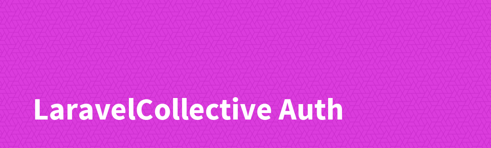

Official documentation for Collective Auth for The Laravel Framework can be found at the [LaravelCollective](https://laravelcollective.com/docs) website.

> This code was derrived from the [Laravel/UI](https://github.com/laravel/ui) package. It's initial MIT licence attributed to Taylor Otwell is included in this packages licence as he is the original creator of the bulk of this code. This package was created for those who opt to not use Jetstream/Fortify.
